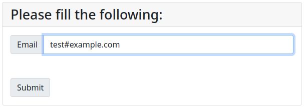

# FormInputField

A gem which wraps up functionality of maintaining values for forms to factor cases where a POST fails model validation while also providing a means to succinctly produce relevant error messages.

Consider a simple form which is primarily defined by an HTML input element and its label:



Consider added functionality which presents a new label informing the user any errors discovered upon POST whilst also maintaining the value the user had previously submitted:


It's important to validate such fields on the server, even if JavaScript is doing this work on the front end. Within Ruby on Rails, (using HAML), the logic may look like the following:

```
%div.input-group
  - value = {}
  - if flash[:values] and flash[:values][:email:]
    - value = {:value => flash[:values][:email]}
  = label :user, :email, 'Email', {:class => "input-group-text"}
  = text_field :user, :email, {:class => "form-control", :placeholder => "Your Email", :disabled => false}.merge(value)
  - if (flash[:errors] and flash[:errors][:email])
    = label :user, :email', flash[:errors][:email][0], {:class => "alert-danger input-group-text"}
```

This gem condenses the above into more a more concise set of method calls:

```
%div.input-group
  = form_input_field :text_field, :user, :email, "Email", {:class => "form-control", :placeholder => "Your Email", :disabled => false}, {:class => "input-group-text"}
  = form_error_field :user, :email, {:class => "alert-danger input-group-text"}
```

This makes a view much more clean and easier to digest at a glance.

## Installation

Add this line to your application's Gemfile:

```ruby
gem 'form_input_field'
```

And then execute:

    $ bundle

Or install it yourself as:

    $ gem install form_input_field

## Usage

This gem places two helper methods into `ActionView::Helpers::FormHelper`. These methods are  `form_input_field` and `form_error_field`.

### form_input_field

`form_input_field` is an abstraction on the software pattern which encapsulates some input element and its label. Additionally, it has built in functionality which helps ensure the input element's value attribute is filled should the flash hash-map contain the presence of this value.

- `form_input_field(helper_sym, object_name, method, label_text = false, options = {}, label_options = {}, value_key = :values)`
  + Outputs two html tags - a label HTML element pointing to its corresponding input HTML element. The term "input HTML element" here is ambiguous; it's not meant to be taken literally. "Input" in this context is meant to be interpreted as any output produced by the following list of helper functions within `ActionView::Helpers::FormHelper`:
    - color_field, date_field, datetime_field, datetime_local_field, email_field, file_field, hidden_field, month_field, number_field, password_field, phone_field, range_field, search_field, telephone_field, text_area, text_field, time_field, url_field, week_field
    - In addition to the above list of `FormHelper` method calls, `form_input_field` captures two special cases - check_box and radio_button. These are described later.
  + The `helper_sym` argument describes the relevant helper function to be called. It expects the method name as a symbol. I.e., if one needs a call to text_field, pass `:text_field`; If one needs a call to password_field, supply a value of `:password_field`, etc.
  + The `object_name` and `method` arguments correspond to the equivalently named arguments as described in `ActionView::Helpers::FormHelper`.
  + The `label_text` argument expects a string for the associated label for the generated input HTML element described by `helper_sym`. Supplying a false will instead not produce a label HTML element.
  + The `options` argument corresponds to a hash-map representing the set of options to be passed with `helper_sym`; the options to be given to a method call from the above set of helper methods. Esentially a hash-map of html properties and attributes. i.e., `{:style => "color:red;"}`
  + The `label_options` argument corresponds to a hash-map representing the set of options to be passed with the call to the label helper function from `ActionView::Helpers::FormHelper`. Essentially a hash-map of html properties and attributes. I.e., `{:style => "color:red;"}`
  + The `value_key` argument is a symbol that acts as a key for the flash hash-map that contains the relevant value filled by the controller. If the value associated with said key within flash is a string, then the string will occupy the `value` attribute for the produced input HTML element. If it is a hash-map, it will then assume that the value given for `method` is the key to the string within this embedded hash-map. Consider the following example:
    - For a view that contains the following call: `form_input_field :person, :name, "Please input a name: "`, the controller contains either `flash[:values] = params[:user][:name]` or `flash[:values] = params[:user]`

#### :check_box helper_sym

#### :radio_button helper_sym

### form_error_field

`form_error_field` is an abstraction on the software pattern which encapsulates the presentation of a validation error. This produces a label HTML element which points to the originating input field. The tex of the label is the error message associated with the failed validation. These errors are typically captured from the model by the controller and sent to the view - where this method call is enacted.

- `form_error_field(object_name, method, label_options = {}, error_key = :errors)`
  + Outputs a label HTML tag whose textual value is located in the flash-hash map corresponding to `error_key`. If the value associated with said key within flash is a string, then this string value willb e used. If it is a hash-map, it will then assume that the value given for `method` is the key to the string within this embedded hash-map. Consider the following example:
    - For a view that contains the following call: `form_error_field :person, :name`, the controller contains either `flash[:errors] = @user.errors[:name]` or `flash[:errors] = @user.errors`
  + The `label_options` argument corresponds to a hash-map representing the set of options to be passed with the call to the label helper function from `ActionView::helpers::FormHelper`. Essentially a hash-map of html properties and attributes. I.e., `{:style => "color:red;"}`


### Examples


## Development

After checking out the repo, run `bin/setup` to install dependencies. Then, run `rake spec` to run the tests. You can also run `bin/console` for an interactive prompt that will allow you to experiment.

To install this gem onto your local machine, run `bundle exec rake install`. To release a new version, update the version number in `version.rb`, and then run `bundle exec rake release`, which will create a git tag for the version, push git commits and tags, and push the `.gem` file to [rubygems.org](https://rubygems.org).

### Finished Work

- [x] Base definition of `form_input_field` such that its optional keyword arguments can be supplied in any order.
- [x] Base definition of `form_error_field` such that its optional keyword arguments can be supplied in any order.

### Future Work

- [ ] A mechanism to set key defaults.
- [ ] Extend these helpers to be compatible with `ActionView::Helpers::FormBuilder`.
- [ ] Create function wrappers specific to the required `ActionView::Helpers::FormHelper` method. I.e., `form_text_field(:model, :object_name)` which calls `form_input_field(:text_field, :model, :object_name)`

Other avenues of work will be listed in the issues section of the repository.

### Contributing

Bug reports and pull requests are welcome on GitHub at https://github.com/alanmmckay/form_input_field.

#### On Versioning

Taken from rubygems.org pattern guide on [semantic versioning](https://guides.rubygems.org/patterns/#semantic-versioning). Semantic versioning boils down to:

- **PATCH 0.0.x** level changes for implementation level detail changes, such as small bug fixes
- **MINOR 0.x.0** level changes for any backwards compatible API changes, such as new functionality/features
- **MAJOR x.0.0** level changes for backwards incompatible API changes, such as changes that will break existing users code if they update

## License

The gem is available as open source under the terms of the [MIT License](https://opensource.org/licenses/MIT).

